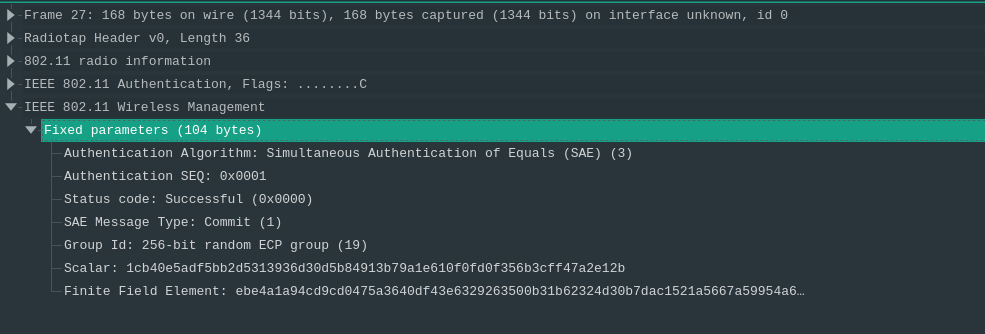
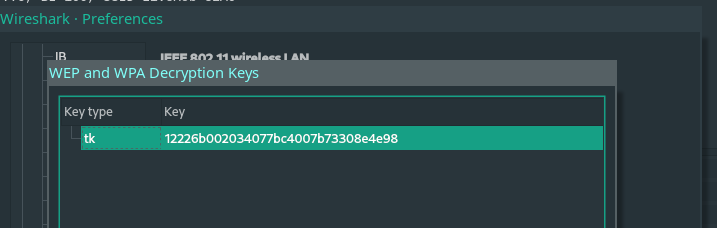
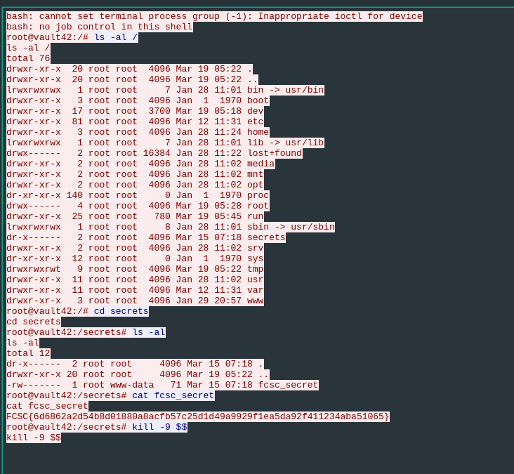

# Antartic Vault 1

# Category

Forensics

# Author

Worty

# Description
La société Antarctic Vault propose à ses clients du stockage au froid pour une meilleure conservation. Ce stockage est donc situé au plus profond de la couche de glace de l'antarctique au sein de nœuds à basse consommation.

Dans ces noeuds, une application permet le stockage de secrets et la récupération via une authentification asymétrique répondant aux plus hauts standards du marché. La connexion des clients aux coffre-forts se fait à l'aide de bornes Wi-Fi avec un niveau de sécurité très élevé.

Cependant, cette société, qui héberge des données très sensibles du FCSC, a pu se rendre compte qu'un acteur malveillant s'était connecté sur un de ses équipements. Un point d'accès malveillant s'est présenté au nœud et celui-ci s'y est connecté. Le Centre des Opération de Sécurité a pu réaliser deux captures, une capture réseau de la connexion du point d'accès et une capture mémoire du nœud avant les opérations de l'acteur malveillant.

Saurez-vous retrouver le secret qui a été exfiltré ?

# Solution

In this challenge, the objective is quite clear, we have been provided with a memory capture and a pcap file, so we will have to decrypt it. If we open this one, we notice several things:



We are given a WiFi capture using SAE encryption and certainly WPA. This is very important for the rest of the challenge, indeed, to decrypt this kind of traffic, we will not use a password with (or without) the SSID as we are used to do. Here, we will need what we call the Transmission Key (tk).

Its format is known (128 bits), and must surely be in the memory dump! I first tried the famous "strings | grep" method to get all strings that match 128 bits strings with hexadecimal characters, then I used this script to bruteforce all the possibilities :

```py
#bf.py
import itertools
import subprocess
from multiprocessing import Process
array_to_split = open("pos","r").read().split("\n")[:-1]
nb_thread = 50
print("Bruteforce started...")

def bruteforce(permutations,id):
	print(f"Thread {id} started with {len(permutations)} possibilities")
	nb_try = 0
	for p in permutations:
		proc = subprocess.Popen(["./decrypt_wpa3.sh",p], stdout=subprocess.PIPE)
		if(len(proc.communicate()[0].decode()) > 344):
			print(f"Found valid tk: {p}")
			print("Stopping bruteforce")
			break
		else:
			nb_try += 1
			if(nb_try % 1000 == 0):
				print(f"Done: {nb_try}/{len(permutations)}")

pool = []
chunk = len(array_to_split) // int(nb_thread)
for i in range(0,int(nb_thread)):
        thread_array = array_to_split[chunk*i:chunk*(i+1)]
        thread = Process(target=bruteforce,args=(thread_array,str(i),))
        pool.append(thread)

if len(array_to_split) % int(nb_thread) != 0:
        start = len(array_to_split) // int(nb_thread) * int(nb_thread)
        thread_array = array_to_split[start:]
        thread = Process(target=bruteforce,args=(thread_array,str(nb_thread),))
        pool.append(thread)
for p in pool:
        p.start()
```

```sh
#decrypt_wpa.sh
#!/bin/bash
tshark -r capture1.pcap -o "wlan.enable_decryption:TRUE" -o "uat:80211_keys:\"tk\",\"$1\""| grep -v "802.11"
```

Unfortunately, it didn't work. Thinking about it and searching on the internet, SAE uses AES for its encryption protocol, so that's when I got the idea to use the "aeskeyfind" tool to get a potential key. What is funny is that my first reflex on this challenge was to use this tool, but I had forgotten it...

Using aeskeyfind, we found 4 possible keys, let's try them on wireshark ! And it work, we manage to decrypt the traffic and get our precious flag !





# Flag

FCSC{6d6862a2d54b8d01880a8acfb57c25d1d49a9929f1ea5da92f411234aba51065}