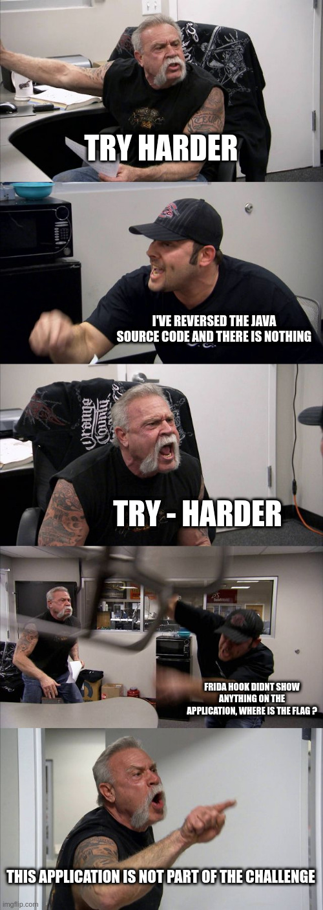
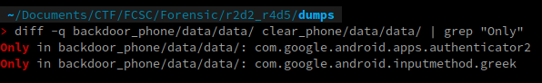
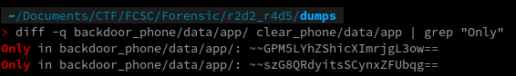

# R2D2

# Category

Forensics

# Author

Worty

# Description
Le PDG de GoodCorp n'en démord pas : son téléphone est backdooré, et en plus de voler ses photos, on lui vole ses mots de passe, son historique de navigation, ses messages, etc. !

On vous confie l'analyse de son téléphone.

Consciencieux, vous décidez d'émuler complètement le téléphone, afin de pouvoir investiguer plus en profondeur.

# Solution

For this challenge I messed up by falling into a rabbit hole. In fact, with the previous wireshark capture I've seen that there is an application with a metasploit backdoor inside, and I was thinking that the second was inside this application, but at the end, no...

To analyze this application, I went to the /data/app folder to retrieve the base of its apk and to be able to pass tools on it that allows to retrieve the source code as well as the information of the AndroidManifest.xml file.

Directly I saw the backdoor, indeed, a package of the application was called 'vyqdu', and if we look inside, we see indeed that a jar file is decrypted on the fly then executed from the application. As I thought the flag was here, I decided to use RMS to hook with frida the creation of this file and retrieve it.

After many attempts I can't get it back, but I did get two dex files used by the application in the runtime, as well as various information (connection ip, port, ...).

After that, CTF administrators added a hint for this challenge "Note: The Authenticator application is not part of the challenge".



Back to square one. To be sure that the application i've found might be the right one, i've decided to create another android emulator with the same kernel, base image, ... and to compare the filesystem of both to see if there's any difference.

I know that in Android there are two main folders for applications :
- /data/data/
- /data/app/

So I simply used the diff command to see the potentially extra folders (so the applications) on the backdoored phone :





As we know that "authenticator2" is out of scope for this challenge, the last potential backdoored application is `com.google.android.inputmethod.greek`. Using adb, I will recover the base of this apk to analyze it on my host :

```sh
adb pull /data/app/~~GPM5LYhZShicXImrjgL3ow==/com.google.android.inputmethod.greek-GPM5LYhZShicXImrjgL3ow==/base.apk .
```

To analyze this applications I've used two tools :
- apktool, to get the AndroidManifest.xml file.
- jadx, to recover the java source code of the application.

Inside "AndroidManifest.xml", we don't learn more about the application, so let's dig inside the Java !

We have one file for this application called "KeyBoarder.java", and which contains a lot of base64 strings. In a first place, I try to decode some random base64 and see what they contains :

```
> echo "aHR0cDovLzE3Mi4xOC4wLjE6ODA4MC95b3Vfd29uLw==" | base64 -d
http://172.18.0.1:8080/you_won/
```

On the first challenge "C3P0", we found the flag on a request to this ip, so we are at the right place !

One base64 isn't cleartext and we can clearly see that the method b do some operations on this one :

```java
    public String b(String str) {
        StringBuilder sb = new StringBuilder();
        for (int i2 = 0; i2 < str.length(); i2++) {
            char charAt = str.charAt(i2);
            if (charAt != ' ' && (charAt = (char) (charAt + '/')) > '~') {
                charAt = (char) (charAt - '^');
            }
            sb.append(charAt);
        }
        return sb.toString();
    }
    //boring java stuff
    java.lang.String r1 = "dXIkckxfZmZiYWVkYmVgNF9lNjZoZTZnYjdjYmVfaDQyaGIzMjM2Ymc1ZTY1NGM0YjU1MzZkYmZmaDZfMzdlaGhjNGdoTg=="
            java.lang.String r1 = r3.a(r1)
            java.lang.String r1 = r3.b(r1)
```

Because I'm lazy, I've just copy and paste the code below inside a java online compiler to get the flag :

```java
import java.util.Base64;
import java.io.UnsupportedEncodingException;
public class Solve{
    public static String a(String str) {
        try {
            return new String(Base64.getDecoder().decode(str), "UTF-8");
        } catch (UnsupportedEncodingException unused) {
            return "";
        }
    }

    public static String b(String str) {
        StringBuilder sb = new StringBuilder();
        for (int i2 = 0; i2 < str.length(); i2++) {
            char charAt = str.charAt(i2);
            if (charAt != ' ' && (charAt = (char) (charAt + '/')) > '~') {
                charAt = (char) (charAt - '^');
            }
            sb.append(charAt);
        }
        return sb.toString();
    }

    public static void main(String[] args){
        System.out.println(b(a("dXIkckxfZmZiYWVkYmVgNF9lNjZoZTZnYjdjYmVfaDQyaGIzMjM2Ymc1ZTY1NGM0YjU1MzZkYmZmaDZfMzdlaGhjNGdoTg==")));
    }
}
```

# Flag

FCSC{0773265361c06ee96e83f43609ca93babe38d6edc4c3ddbe53779e0bf6994c89}